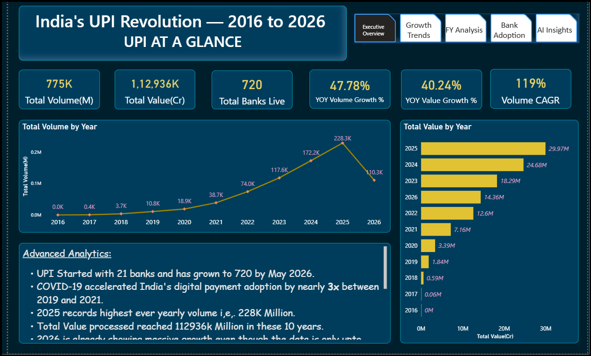
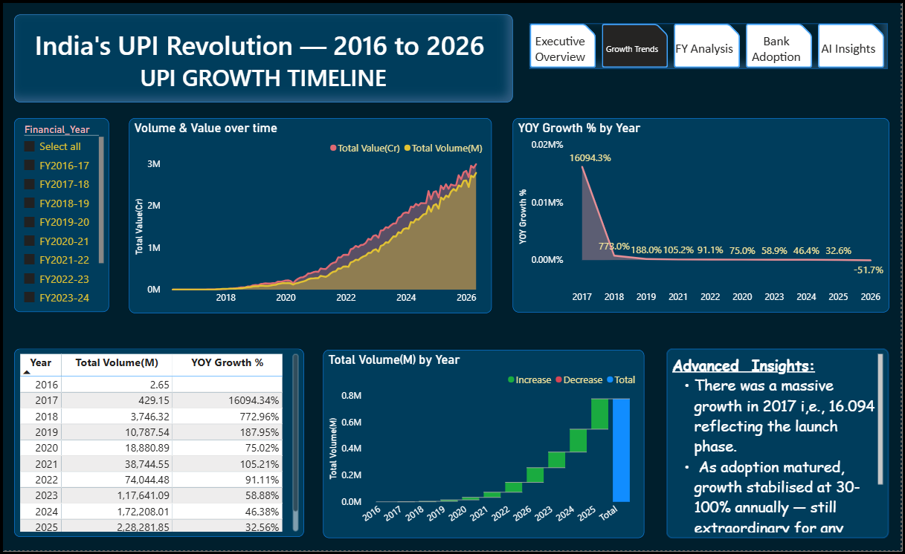
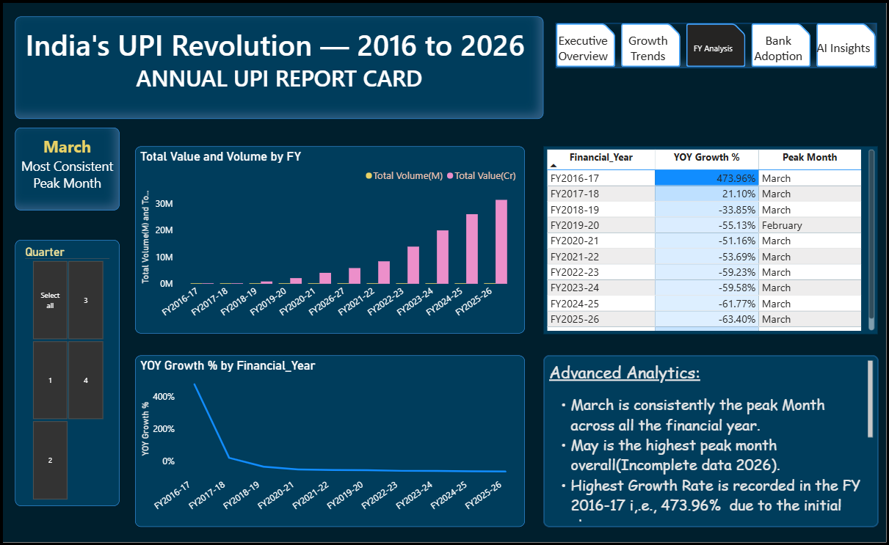
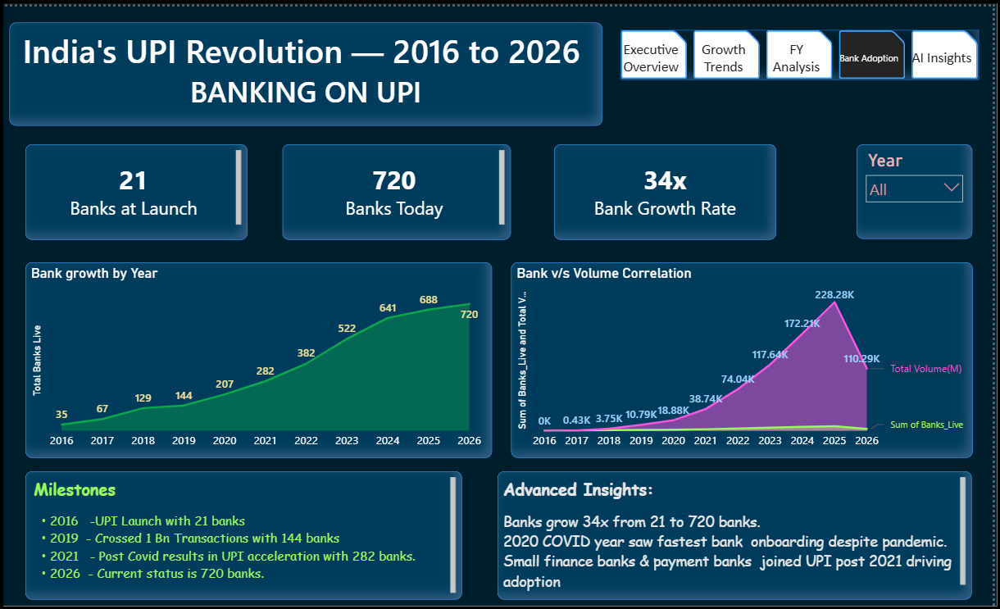
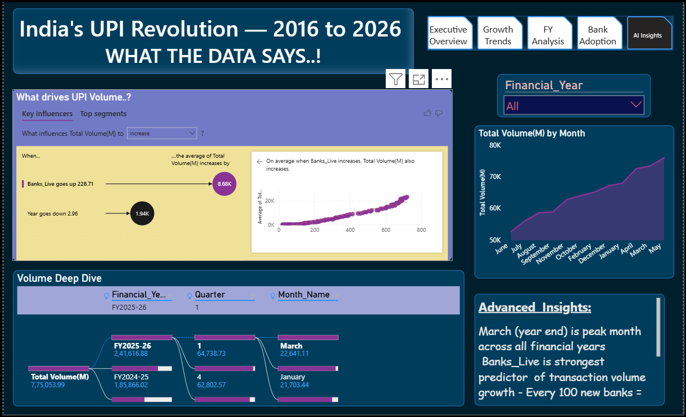

# UPI Growth & Adoption Analytics Dashboard

End-to-end analytics project tracking India's Unified Payments Interface (UPI) growth from launch (April 2016) to May 2026, using NPCI's official monthly "Product Statistics" reports.

**Pipeline:** Excel (11 raw NPCI files) → Python (pandas cleaning) → MySQL (analysis queries) → Power BI (5-page interactive dashboard)

---
## Project Workflow


NPCI Excel Reports (11 Files)
        │
        ▼
Python (Pandas)
Data Cleaning & Merging
        │
        ▼
MySQL Database
Storage & SQL Analysis
        │
        ▼
Power BI
Power Query → DAX → Dashboard
        │
        ▼
Business Insights

---

## 📊 Headline Numbers

| Metric | Value |
|---|---|
| Volume CAGR (2017–2025) | 119% |
| Bank network growth | 21 → 720 banks (34x) |
| Total transaction volume | 775K million |
| Total transaction value | ₹1,12,936K crore |
| Time span | April 2016 – May 2026 (122 monthly records) |

---

## 🗂️ Repository Structure

```
├── README.md
├── DOCUMENTATION.md                  # Project write-up: methodology, DAX, insights
├── UPI_Analysis.ipynb                # Python data cleaning (pandas)
├── UPI_Project_queries.sql           # MySQL schema + analysis queries
├── UPI_Transactions.pbix             # Power BI dashboard file
└── screenshots/
    ├── 1_Executive_Overview.png
    ├── 2_Growth_Trends.png
    ├── 3_FY_Analysis.png
    ├── 4_Bank_Adoption.png
    └── 5_AI_Insights.png
```

---

## 🔧 Tech Stack

- **Python (pandas)** — merged 11 raw Excel files, cleaned data types, built custom Indian Financial Year (April–March) logic
- **MySQL** — schema design, aggregations, window functions (`LAG()`), correlated subqueries, views
- **Power BI** — Single-table analytical model with 11 DAX measures, Time Intelligence, CAGR analysis, and AI visuals.

---

## 📄 Data Source

Source: **NPCI (National Payments Corporation of India)**

Official **Product Statistics – UPI** monthly reports, publicly available from the NPCI website.

---

## 📖 Full Documentation

See [`DOCUMENTATION.md`](DOCUMENTATION.md) for:
- The Python cleaning pipeline explained
- SQL query approach (window functions, subqueries, views)
- All DAX measures and what they do
- Dashboard page walkthrough
- Key business insights

---

## 📸 Dashboard Preview

**Executive Overview**


**Growth Trends**


**FY Analysis**


**Bank Adoption**


**AI Insights**


---

## 👤 Author

**Sreelakshmi K.A.**

Aspiring Business Intelligence & Data Analyst | Power BI Developer
